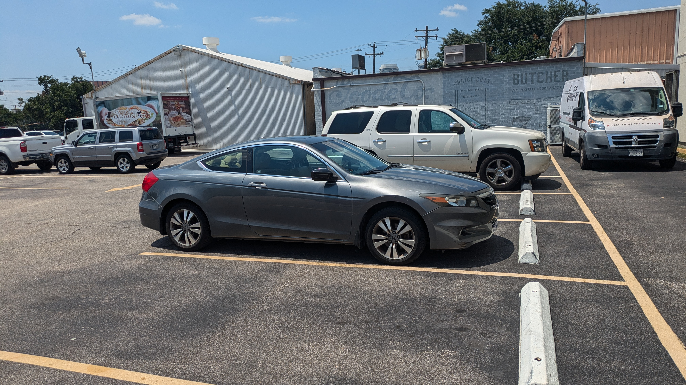
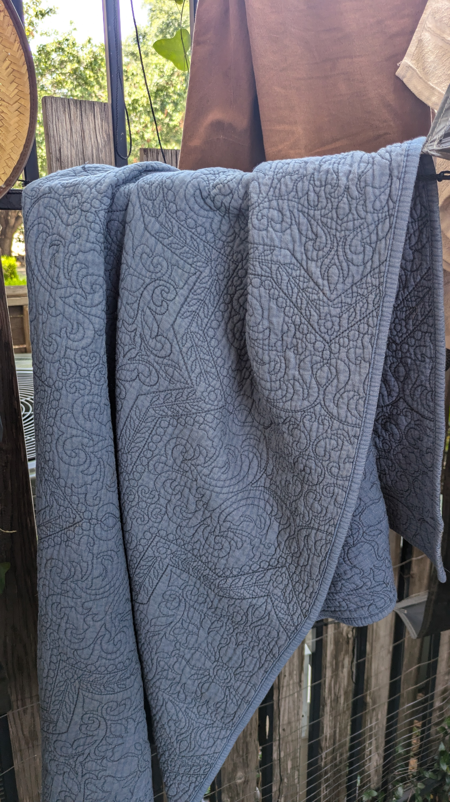
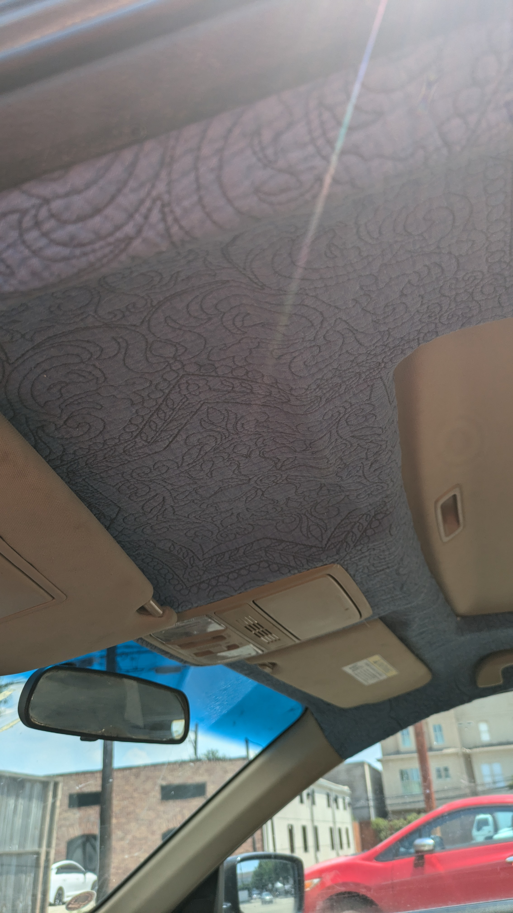
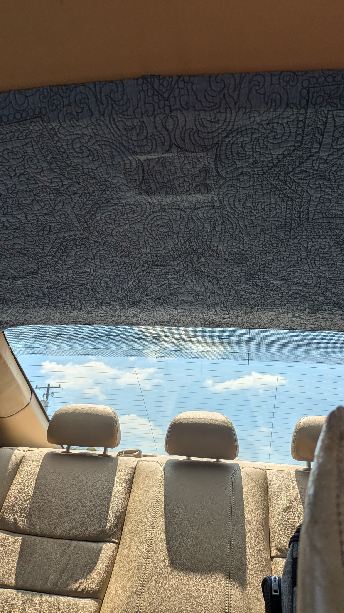
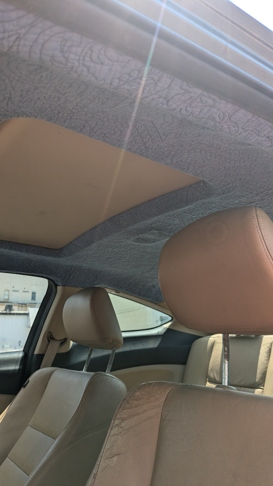

+++
title =  "Honda Accord Headliner Redo"
date = "2024-06-14"
description = "Redoing the headliner in an old Honda Accord"
author = "Justin Napolitano"
tags = ['automotive']
images = ["my-baby-2.jpg"]
+++

My beautiful 12 year old Honda

## Why

The foam holding it in place to the headliner board deteriorated. The car is too old to make it perfect so any headliner fabric will work.  

## Find a suitable headliner replacement fabric

I live in Texas and its hot. Really hot.  Without some insulation the heat from the sun would bake me inside my car.  I have an old quilt with some sort of poly batting that I will use for the headliner.

## Use some mylar

I also have some old emergency blankets that I use for various projects and to build kits when I go out camping.  I plan to add a sheet or two to the top of the board to make sure to help reflect some of the summer heat away from the passenger compartment.  

## Remove the headliner

The headliner is held together by just a few plastic rivets and the accessories in the the roof. Reference the video below

<!-- [Headline Removal Link](https://www.youtube.com/watch?v=jVpBV9uR7Z8) -->


### Peeling off the headliner

The foam on my headliner had completely deteriorated. I would recommend using a mask and safety glasses for this part of the job. 

### Remove the fabric

The fabric is easy to peel off.  Just start by pulling it away. 

### Remove the excess foam

I made a mistake when I first started by using a wet brush that only caused the adhesive to stick everywhere. Once I let the brush dry, I took it to the board and scrubbed as much of the old foam away as I could.  I then took used adhesive remover to remove the old glue. After the solvent did its work I rinsed the whole thing off with a slightly damp rag 

## Install the new headliner

### Cut the new headliner

First place the headliner material onto the board.  Then, put the accessories removed from the headliner in the previous steps into place.  With a razor cut holes in the board to fit the accessories. Place them through the headliner as if they were attached to the board.  When all are in place cut the excess headliner material around the board leaving about 2 inches or so to fold around the edges.

### Glue to the board

Use a headliner adhesive. I used a 3M headliner adhesive that seems to have worked well and is holding up in the summer heat.  

I adhered the headliner in strips starting at the top of the board moving to the back. I went about a quarter of the board at a time and placed the accessories into their correct spots as I glued. 

### Wait to set

The adhesive sets quickly, but I let it sit for about two hours prior to working with it again. 

## Instal the mylar

On the back of the board I laid out a sheet of mylar and cut holes in it to allow the plastic rivets and accessories to connect to the sheet metal of the roof of the car. I then sprayed the whole thing down with adhesive.  This was an easy step and far more forgiving than the headliner because it is out of site. 

## Reinstalling the headliner board

### Get the board in the car

To get the board back into the car, I had to remove the head supports from the the seats and move the seats as far back as possible. I then pushed the back of the board into the car first and slowly maneuvered the board into place. 

### Reattach the board

I just went in reverse from removal. It was a simple process. 

### Reattach the headliner accessories

Again go in reverse from what you had done previously.  If the accessories do not fit then some of the headliner material will likely need to be removed so the plastic can attach to the correct points in the sheet metal. 

## Finished product

The finished headliner looks okay..I admit it looks kinda diy, but that is the thrill of doing things like this.  The quilt goes well enough with the car to not be annoying.  The mylar sheets work surprisingly well. I am considering going back and filling the empty space with aluminum foil clumps to improve the insulating power.

